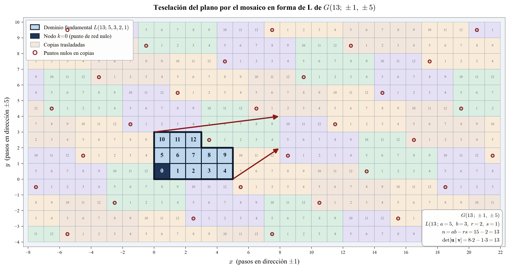

En el capítulo anterior identificamos el grafo abstracto de Heegaard de un espacio lente como un **grafo circulante**. Esta misma familia de grafos ha sido estudiada de forma independiente y muy extensa desde otro punto de vista: el de las **redes de interconexión**. En esa literatura, un circulante con dos generadores simétricos se conoce como una **red de doble lazo no dirigida** (*undirected double-loop network*), y se denota

$$G(n;\, \pm s_1,\, \pm s_2)$$

donde $n$ es el número de nodos, $1 \leq s_1 < s_2 < n/2$ son los **pasos**, y $\gcd(n, s_1, s_2) = 1$.

Adoptar esta terminología nos permite conectar nuestros objetos topológicos con una rica teoría desarrollada para optimizar el diseño de redes. El estudio de estas redes fue propuesto originalmente por Wong y Coppersmith para la organización de memorias multimodulares y representan un punto intermedio práctico entre las redes de un solo lazo (anillos simples), que sufren de largos retardos y baja fiabilidad, y las redes con más de dos lazos, que requieren hardware costoso y control complejo. Gracias a este equilibrio, las redes de doble lazo se han utilizado en diversas aplicaciones, como en topologías de redes de computadoras (SONET, FDDI), y para el alineamiento de datos en procesadores SIMD.

::: {.callout-note}
## Definición: Red de Doble Lazo No Dirigida $G(n;\pm s_1, \pm s_2)$

Es el grafo no dirigido $(V, E)$ con

$$V = \mathbb{Z}/n\mathbb{Z} = \{0, 1, \ldots, n-1\}$$

$$E = \bigl\{\{i,\, i \pm s_1 \bmod n\},\;\{i,\, i \pm s_2 \bmod n\} \;\big|\; i = 0, 1, \ldots, n-1\bigr\}$$

La red es conexa si y solo si $\gcd(n, s_1, s_2) = 1$. Todo vértice tiene grado $4$, salvo cuando $2s_k \equiv 0 \pmod{n}$, caso en que dos vecinos coinciden y el grado se reduce.
:::

### La familia que estudiamos: $G(p;\,\pm 1,\,\pm q)$

En el contexto de este curso, los grafos de doble lazo de interés son los que surgen del encaje de Heegaard del espacio lente $L(p,q)$. Fijamos, pues, $n = p$ primo y pasos $s_1 = 1$, $s_2 = q$:

::: {.callout-tip}
## Grafo de Heegaard de $L(p,q)$

El grafo abstracto subyacente al encaje de Heegaard de $L(p,q)$ en el toro es el grafo de doble lazo

$$G(p;\,\pm 1,\,\pm q)$$

con $p$ vértices, $2p$ aristas y grado $4$ en cada vértice. Las $p$ aristas de paso $1$ forman un ciclo hamiltoniano, y las $p$ aristas de paso $q$ forman otro.
:::

## El Mosaico en Forma de L

### Importancia: Diagrama de Distancias Mínimas

Un resultado fundamental de la teoría de redes de doble lazo es que el mosaico en forma de L codifica el **diagrama de distancias mínimas** (MDD) de la red. Esto es crucial para problemas de optimización, como encontrar la red con el diámetro mínimo (máximo retardo de transmisión), ya que el diámetro se puede calcular directamente a partir de los parámetros del mosaico [1].

Más aún, se ha demostrado que dos redes de doble lazo que realizan la misma forma de L son isomorfas [2]. Esto establece una conexión profunda entre la geometría combinatoria del mosaico y la estructura de isomorfismo del grafo abstracto, un análogo en el mundo de las redes de lo que observamos en los espacios lente con los grafos de Heegaard [3].

---

### Construcción del patrón

Para el grafo $G(p;\pm 1, \pm q)$, construimos el **patrón de etiquetado** en el plano entero siguiendo el procedimiento de Wong y Coppersmith:

1. Ordenar los puntos del primer cuadrante $\mathbb{Z}_{\geq 0}^2$ por distancia Manhattan creciente:
$$(0,0),\;(1,0),\;(0,1),\;(2,0),\;(1,1),\;(0,2),\;\ldots$$

2. En cada punto $(x, y)$, calcular $k \equiv x + yq \pmod{p}$.

3. Si $k$ **no ha aparecido antes**, escribirlo en $(x, y)$; si ya apareció, dejar el punto en blanco.

4. Detenerse cuando se hayan etiquetado los $p$ valores $\{0, 1, \ldots, p-1\}$.

La región resultante tiene siempre forma de **L** y tesela el plano entero.

::: {.callout-note}
## Definición: Mosaico en Forma de L — $L(n;\, a, b, r, s)$

La región obtenida por el procedimiento anterior se llama **mosaico en forma de L** con parámetros enteros $a, b, r, s$ tales que

$$a, b \geq 2, \qquad 0 \leq r < a, \qquad 0 \leq s < b, \qquad n = ab - rs$$

Se escribe $L(n;\, a, b, r, s)$ y es el rectángulo $a \times b$ al que se le ha quitado el rectángulo $r \times s$ de una esquina.
:::

::: {.callout-important}
## Propiedad de teselación

El mosaico $L(n;\,a,b,r,s)$ **tesela el plano** $\mathbb{Z}^2$ sin solapamientos ni huecos. Los vectores de traslación que generan la teselación son los **puntos de red nulos** del reticulado, es decir, los puntos $(x,y) \in \mathbb{Z}^2$ con $x + yq \equiv 0 \pmod{p}$ más cercanos al origen distintos de $(0,0)$.

Esta propiedad es la base del algoritmo de enrutamiento óptimo en tiempo constante para redes de doble lazo.
:::

### Lemas estructurales

Sean $L(n;\,a,b,r,s)$ el mosaico determinado por $G(n;\,1,q)$. Entonces:

- $a > r \geq 0$, $\;b > s \geq 0$, $\;b \geq r$, $\;a > s$, $\;ab - rs = n$

- $-a\cdot 1 + s\cdot q \equiv 0 \pmod{n}$
- $-r\cdot 1 + b\cdot q \equiv 0 \pmod{n}$
- $(a-r)\cdot 1 + (b-s)\cdot q \equiv 0 \pmod{n}$

Estos **puntos de red nulos** $(-a, s)$, $(-r, b)$ y $(a-r, b-s)$ (o sus equivalentes positivos módulo traslaciones del reticulado) son exactamente los vértices del reticulado que genera la teselación periódica del plano.

---

## Ejemplo: $G(13;\,\pm 1,\,\pm 5)$

### Construcción paso a paso

Aplicamos el procedimiento al grafo $G(13;\,\pm 1,\, \pm 5)$ con $p=13$, $q=5$.

| Punto $(x,y)$ | $x + 5y \bmod 13$ | ¿Nuevo? |
|:---:|:---:|:---:|
| $(0,0)$ | $0$ | ✓ |
| $(1,0)$ | $1$ | ✓ |
| $(0,1)$ | $5$ | ✓ |
| $(2,0)$ | $2$ | ✓ |
| $(1,1)$ | $6$ | ✓ |
| $(0,2)$ | $10$ | ✓ |
| $(3,0)$ | $3$ | ✓ |
| $(2,1)$ | $7$ | ✓ |
| $(1,2)$ | $11$ | ✓ |
| $(0,3)$ | $15 \equiv 2$ | ✗ |
| $(4,0)$ | $4$ | ✓ |
| $(3,1)$ | $8$ | ✓ |
| $(2,2)$ | $12$ | ✓ |
| $(1,3)$ | $16 \equiv 3$ | ✗ |
| $(4,1)$ | $9$ | ✓ $\;\leftarrow$ completo |

Con los 13 valores etiquetados, el mosaico resultante es $L(13;\,5,\,3,\,2,\,1)$:

$$n = ab - rs = 5 \cdot 3 - 2 \cdot 1 = 13 \checkmark$$

La disposición es:

$$\begin{array}{ccccc}
\boxed{10} & \boxed{11} & \boxed{12} & & \\
\boxed{5}  & \boxed{6}  & \boxed{7}  & \boxed{8}  & \boxed{9} \\
\boxed{0}  & \boxed{1}  & \boxed{2}  & \boxed{3}  & \boxed{4}
\end{array}$$

5 columnas en $y=0,1$ y 3 columnas en $y=2$; la esquina superior derecha de $r \times s = 2 \times 1$ celdas queda recortada.

### Verificación de los lemas con $a=5,\,b=3,\,r=2,\,s=1$

$$-a + sq = -5 + 1\cdot 5 = 0 \equiv 0 \pmod{13} \checkmark$$
$$-r + bq = -2 + 3\cdot 5 = 13 \equiv 0 \pmod{13} \checkmark$$
$$(a-r) + (b-s)q = 3 + 2\cdot 5 = 13 \equiv 0 \pmod{13} \checkmark$$

Los puntos de red nulos más próximos (en coordenadas positivas) son $(8,\,1)$ y $(3,\,2)$, con determinante $8\cdot 2 - 1\cdot 3 = 13 = p$, confirmando que generan el reticulado correcto.

### Diagrama de la teselación

{fig-align="center" width="100%"}

---

## Referencias

1.  Hwang, F. K. (2001). A complementary survey on double-loop networks. *Theoretical Computer Science*, 263(1-2), 211–229. <https://doi.org/10.1016/S0304-3975(00)00243-7>

2.  Chen, C., & Hwang, F. K. (2000). The Minimum Distance Diagram of Double-Loop Networks. *IEEE Transactions on Computers*, 49(9), 977–979. <https://doi.org/10.1109/12.869029>

3.  Frías, J., Gómez-Larrañaga, J. C., León-Medina, J. L., & Manjarrez-Gutiérrez, F. (2025). *3-manifold polynomials*. arXiv:2510.06651 [math.GT]. <https://doi.org/10.48550/arXiv.2510.06651>
